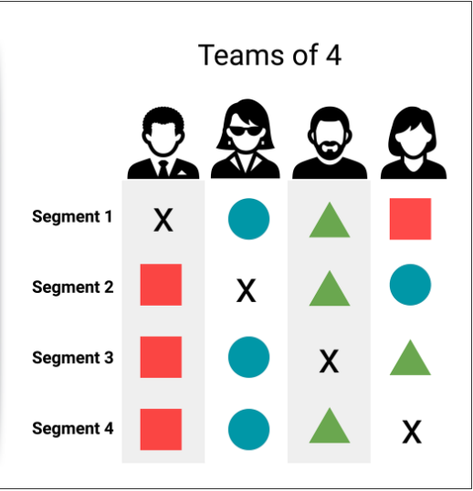

# Lyme Disease Analysis

## Team Members
1. Efren Bernal
2. Aida Beguliyeva
3. Christina Bay
4. Susan Tsoglin

## Data Sources
### Tick Data
https://www.cdc.gov/ticks/surveillance/TickSurveillanceData.html
- Counties classified as “present” are those where Borrelia burgdorferi s.s. or Borrelia mayonii have been identified in one or more host-seeking Ixodes scapularis or Ixodes pacificus ticks, using species-specific molecular methods.
- Counties classified as “no records” should not be interpreted as the pathogen being absent. No records could be a result of a lack of sampling efforts, tick collections, pathogen testing in collected ticks, or a lack of reporting or publishing the results of sampling efforts.

### Demographic Data
https://www.countyhealthrankings.org/explore-health-rankings/rankings-data-documentation
https://www.countyhealthrankings.org/explore-health-rankings/rankings-data-documentation/national-data-documentation-2010-2019
- Population by county
- Median income by county
- Gender distribution by county
- Race distribution by county
- Health Rankings by county by state

### Lyme Disease Data
https://www.cdc.gov/lyme/stats/survfaq.html
- Diagnostic data between 2000 and 2019 by county

### Geographic Data
https://simplemaps.com/data/us-counties
- County
- Latitute/Longitude

## Team Roles

## Week 1
### Circle Role (ERD + Tables): Christina
- created an ERD using quickdatabasediagrams.com for our SQL tables

### Square Role (Github Repository): Susan
- created the main github, updated ReadMe

### Circle Role (Machine Learning Models): Efren

### X Role (Technology): Aida

## Week 2:
- Square:
- Triangle:
- Circle:
- X:

## Week 3:
- Square:
- Triangle:
- Circle:
- X:

## Week 4:
- Square:
- Triangle:
- Circle:
- X:

## Questions
