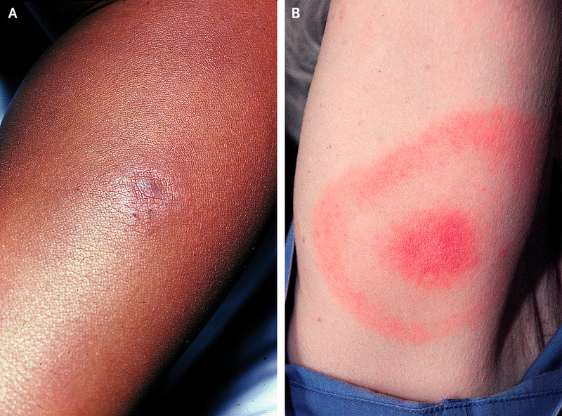
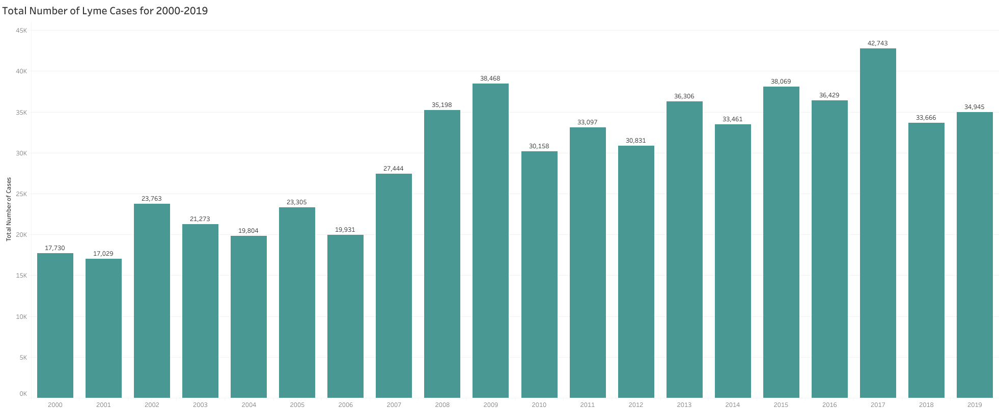
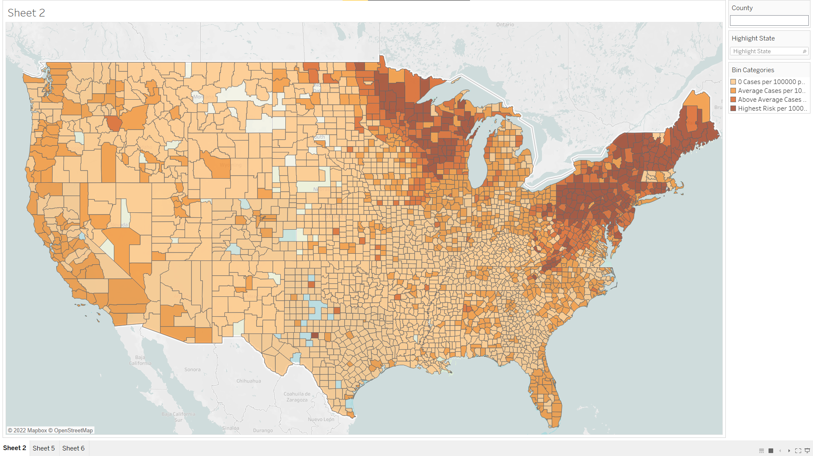
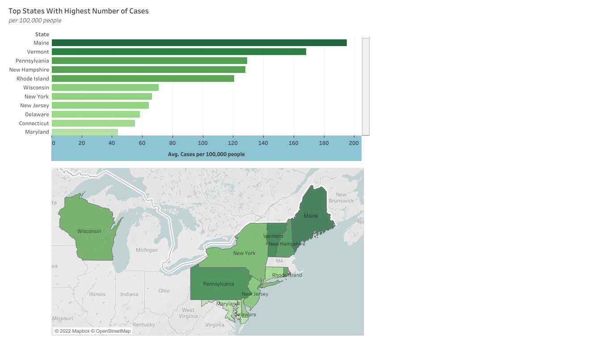
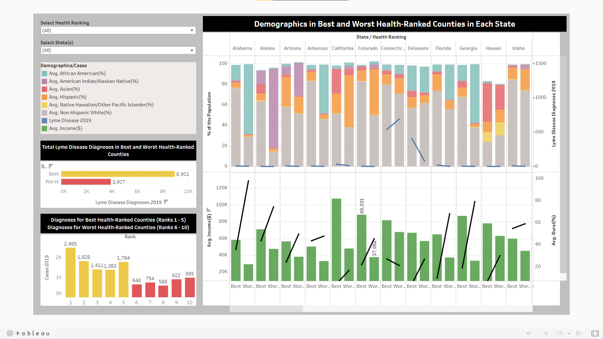
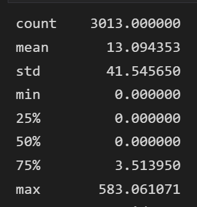
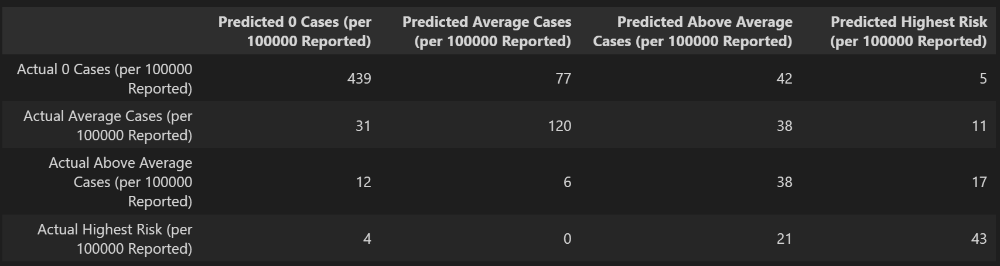
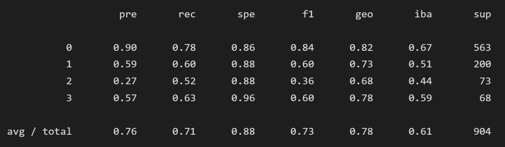
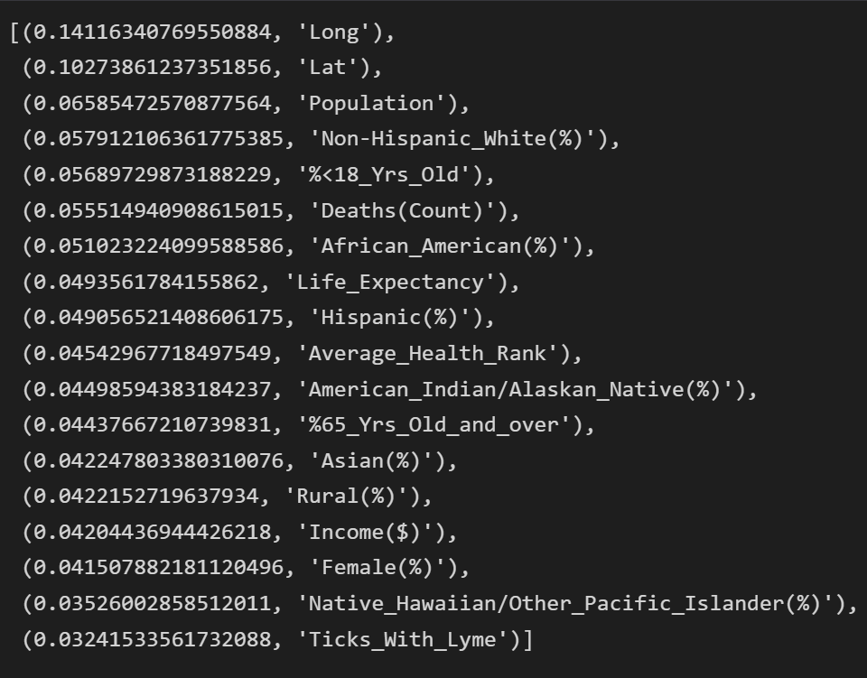

# Lyme Disease Analysis

## Overview

### Introduction | Lyme Disease 

Lyme disease is a bacterial infection caused by members of the ***Borrelia burgdorferi sensu lato*** complex.  While historically most cases clustered into certain geographic regions, the infection is increasingly widespread across the globe.  Lyme disease is the most common vector-borne disease in the United States, with the Centers for Disease Control (CDC) estimating that more than 300,000 cases of Lyme disease are diagnosed each year.  

The infection is often multisystemic – involving joints, heart, and the nervous system sickness. According to the CDC, Lyme diagnosis typically considers: 
- The signs and symptoms of Lyme disease.
- The likelihood that the patient has been exposed to infected blacklegged ticks.
- The possibility that other illnesses may cause similar symptoms.
- Results of laboratory tests, when indicated.

Although early recognition and treatment lead to resolution of illness for many patients, there are many who live with persistent, debilitating symptoms, and persistent infection.  Furthermore, the 'bullseye' rash (known as eythema migrans) is not always present or easily remembered by patients and could be difficult to find on darker complexions.  

> 

The lack of the telltale rash along with validated direct testing methods make the diagnosis of Lyme disease difficult. Furthermore, the surveillance data reported by CDC is dependent upon local health departments:

>"Reports of Lyme disease are collected and verified by state and local health departments in accordance with their legal mandate and surveillance practices. There is no way of knowing exactly how many people get Lyme disease.  A recently released estimate based on insurance records suggests that each year approximately 476,000 Americans are diagnosed and treated for Lyme disease.  This number is likely an over-estimate of actual infections because patients are sometimes treated presumptively in medical practice. Regardless, this number indicates a large burden on the health care system and the need for more effective prevention measures." 

This analysis aims to explore differences in Lyme reporting by county, featuring surveillance data of Lyme in 2019, government health rankings, and general demographic information by county.  Our hypothesis: if a county has a higher average health rankings, then the amount of Lyme diagnosis would be higher than lower ranked counties. Using Tableau, we will visualize the different demographic data compared to Lyme incidence diagnosed.  Then, using scikit-learn machine learning library, we will try to predict the prevalance of Lyme based on the same demographic features.    

## Segment 1-3
### Circle Role (ERD + Tables): Christina
- created an ERD using quickdatabasediagrams.com for our SQL tables
- created SQLite file

### Square Role (Github Repository): Susan
- data ETL
- created the main github, updating ReadMe
- created Tableau visualization

### Circle Role (Machine Learning Models): Efren
- data ETL
- linear regression model for machine learning

### X Role (Technology): Aida
- data ETL
- created the technology.md file
- created Tableau visualization

### Resources
- Python v. 3.7.11
  - Pandas
  - Scikit-Learn
- Jupter Notebook v. 6.3.0
- Anaconda3 
-   
- Microsoft Excel
- Tableau Desktop, Tableau Public v. 2022.1
- PgAdmin4 v. 11.13
  - SQLite, SQL

### Data Sources
#### Tick Data
https://www.cdc.gov/ticks/surveillance/TickSurveillanceData.html
- Counties classified as “present” are those where Borrelia burgdorferi s.s. or Borrelia mayonii have been identified in one or more host-seeking Ixodes scapularis or Ixodes pacificus ticks, using species-specific molecular methods.
- Counties classified as “no records” should not be interpreted as the pathogen being absent. No records could be a result of a lack of sampling efforts, tick collections, pathogen testing in collected ticks, or a lack of reporting or publishing the results of sampling efforts.

#### Demographic Data
https://www.countyhealthrankings.org/explore-health-rankings/rankings-data-documentation
https://www.countyhealthrankings.org/explore-health-rankings/rankings-data-documentation/national-data-documentation-2010-2019
- Population by county
- Median income by county
- Gender distribution by county
- Race distribution by county
- Health Rankings by county by state

#### Lyme Disease Surveillance Data
https://www.cdc.gov/lyme/stats/survfaq.html
- Diagnostic data between 2000 and 2019 by county

#### County Geographic Data
https://simplemaps.com/data/us-counties
- County
- Latitute/Longitude

## Results

### Total Number of Lyme Cases for 2000-2019

### Prevalance of Lyme by County

### Top States with Highest Number of Lyme Cases

### Demographics in the Best vs. Worst Health Ranked Counties

### Statistical Breakdown of Lyme Reported in 2019

### Random Forest Ensemble (Machine Learning Model)
- The `Balanced Random Forest` Model was able to predict the prevalance of Lyme with 63.31% accuracy
- Below is a summary of how it performed:

## Summary

### Links to Tableau Public:
https://public.tableau.com/app/profile/aida.beguliyeva/viz/Lyme03_19_2022/Casesper10000people
https://public.tableau.com/app/profile/susan.tsoglin/viz/LymeDiseaseDemographics/Dashboard2?publish=yes

### Link to Google Slides:
https://docs.google.com/presentation/d/12n1YGEqjTqJ9EIF2QcgZdu50UjiREnlX9md6dkTfivE/edit#slide=id.g12094e55801_1_6

